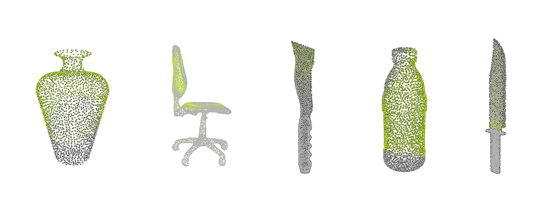

# **3D Neural Affordance Highlighter**

  

---

## **📌 Overview**
This project extends the **3D Highlighter** framework to localize affordance regions in **3D point clouds** using **CLIP-based textual supervision**. It explores whether affordance regions on common household objects (e.g., doors, bottles, and knives) can be detected **without explicit 3D labels**, relying on **differentiable rendering, neural networks, and vision-language models**.

We experiment with different **prompting strategies**, **hyperparameter tuning**, and **evaluation metrics** to assess the effectiveness of **unsupervised affordance highlighting**.

---

## **📂 Repository Structure**
```
📦 Affordance3DHighlighter
├── 📁 data/                  # Contains the AffordanceNet dataset and processed data files
├── 📁 demo/                  # Example runs and output visualizations
├── 📁 docs/                  # Project documentation, final report, and presentation slides
├── 📁 images/                # Sample affordance visualizations
├── 📁 media/                 # Additional project-related media
├── 📁 src/                   # Source code for affordance highlighting
│   ├── data_loader_fullshape.py      # Data loading and preprocessing
│   ├── neural_highlighter.py         # Neural affordance highlighter architecture
│   ├── render/cloud_point_renderer.py # Differentiable point cloud renderer
│   ├── Clip/clip_model.py            # CLIP model integration
│   ├── Clip/loss_function.py         # CLIP loss computation
│   ├── save_results.py               # Functions to save visualizations and evaluations
│   ├── prompt_strategies.py          # Different affordance-specific prompting strategies
├── 3Dhighlighter_pointcloud_multiview.ipynb  # Main notebook for training and evaluation
├── testingDataset.ipynb              # Additional dataset testing script
├── point_cloud_visualization.ipynb    # Visualization notebook for 3D affordance highlighting
├── extensions.ipynb                   # Code extensions and alternative configurations
├── README.md                          # Project documentation
```

---

## **🎯 Project Goals**
### **1️⃣ Unsupervised 3D Affordance Localization**
- Detect **hand-object interaction affordances** in **point cloud representations** without labeled supervision.
- Train a **Neural Highlighter model** that learns affordance-specific regions.

### **2️⃣ Exploring Different Prompting Strategies**
- Compare **basic**, **affordance-specific**, and **descriptive** prompts.
- Evaluate the effectiveness of CLIP-generated affordance regions.

### **3️⃣ Hyperparameter Optimization**
- Grid search over:
  - **Learning rates** (0.0001, 0.001, 0.01)
  - **Network depths** (4, 5)
  - **Number of views** (2, 3)
  - **Augmentations** (1, 3)
  - **Threshold values** (0.3, 0.5, 0.7)

### **4️⃣ Performance Evaluation using Robust Metrics**
- **IoU (Intersection over Union)** to assess segmentation accuracy.
- **aIoU (affordance-weighted IoU)** to measure affordance-specific localization.
- **CLIP-based similarity scores** to evaluate textual alignment.

---

## **📂 Dataset: 3D AffordanceNet**
We utilize the **3D AffordanceNet** dataset, which contains:
- **22,949 objects** from **23 semantic classes**.
- **18 affordance labels** related to **hand-object interactions**.
- **Pre-processed point clouds** with normalized coordinates.

### **Training & Evaluation Setup**
- **Validation and Test Splits**: Defined subsets from the dataset.
- **Point Cloud Normalization**: Objects are centered and scaled.
- **Rendered Views**: Differentiable rendering of point clouds for CLIP-based training.

---

## **🛠️ Methodology**
### **🔹 Neural Highlighter Architecture**
- An **MLP-based network** trained to predict affordance probabilities.
- Uses **differentiable rendering** and **CLIP loss** for affordance learning.

### **🔹 Differentiable Rendering**
- **Multi-view point cloud projections** are generated using **Kaolin and PyTorch3D**.
- **Rendered images** are aligned with **CLIP text embeddings** for affordance detection.

### **🔹 Prompt-Based Training**
- **Affordance-specific prompts** guide affordance highlighting.
- **Descriptive and basic prompts** are compared for effectiveness.

### **🔹 Optimization & Loss**
- **Contrastive loss** computed between rendered affordance regions and CLIP text embeddings.
- **Adam optimizer** with **grid-searched hyperparameters**.

---

## **📊 Experiments & Results**
We perform **grid search validation** and **test evaluation** to optimize affordance highlighting.

### **1️⃣ Single-Class Affordance Localization (Doors)**
- **Target Affordances**: Openable, Pushable, Pull
- **Best Configuration**:  
  - **Strategy:** Affordance-Specific  
  - **Threshold:** 0.5  
  - **Learning Rate:** 0.001  
  - **Validation IoU:** 0.441  

### **2️⃣ Generalization to Unseen Objects**
- The best model is **tested on new test objects**.
- The **final test mIoU drops to 0.075**, indicating **overfitting**.

### **3️⃣ Cross-Class Generalization (Optional)**
- **Tested objects:** Chair, Bottle, Knife.
- **Findings:** The affordance-specific strategy **struggles across different object geometries**.


## **📥 Installation & Usage**
### **🖥️ Setup**
```bash
pip install torch torchvision tqdm numpy open3d
pip install git+https://github.com/openai/CLIP.git
pip install kaolin==0.17.0 -f https://nvidia-kaolin.s3.us-east-2.amazonaws.com/torch-2.5.1_cu121.html
pip install pytorch3d
```

### **🚀 Running the Pipeline**
#### **1️⃣ Training the Model**
```bash
python train.py --dataset_path data/full_shape_train_data.pkl --device cuda
```

#### **2️⃣ Running Validation Grid Search**
```bash
python evaluate.py --dataset_path data/val_set.pkl --strategy affordance_specific --threshold 0.5
```

#### **3️⃣ Testing the Best Model**
```bash
python test.py --test_data data/test_set.pkl --best_strategy affordance_specific --best_threshold 0.5
```

---

## **📌 Limitations & Future Work**
### **Challenges**
- **Localized affordances** (e.g., handles, hinges) are difficult to detect.
- **CLIP struggles with spatial relationships**, affecting segmentation accuracy.
- **Overfitting to validation objects** limits test generalization.

### **Future Directions**
- Explore **alternative models** such as **OpenShape**.
- Incorporate **geometric priors** for better spatial alignment.
- Experiment with **real-world LiDAR point clouds**.

---
